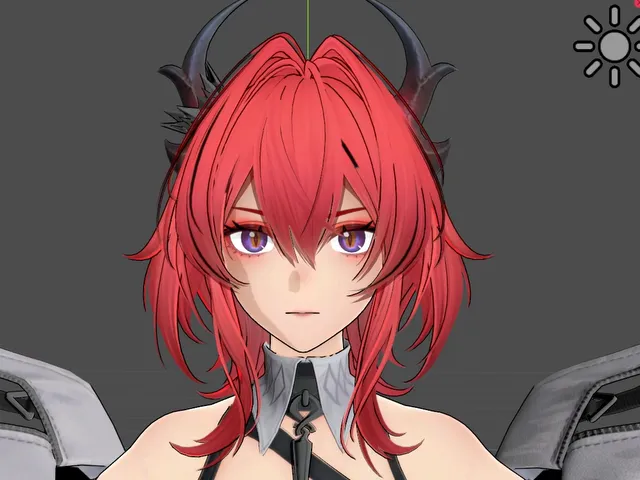

# Godot 4 Stylized Anime Shader Kit
A collection of professional-grade shaders for **Godot 4.x** designed to achieve high-quality anime/manga aesthetics. This kit solves common stylized rendering issues such as unstable facial shadows and inconsistent outlines.

### Key Features

#### Anime SDF Face Shader (Dynamic Symmetry)

Unlike basic Cel Shaders, this shader uses **SDF (Signed Distance Fields)** textures to project facial shadows.
* **Symmetry Logic:** Automatically detects light direction and flips the shadow map UVs. This ensures nose and cheek shadows remain artistic and clean from any angle.
* **World-Space Stability:** Calculations are performed in World Space. Shadows won't "wobble" or deform when the camera rotates.

#### Anime Body Shader
Optimized for clothing, hair, and the character's body.
* **Flattened XZ Lighting:** Lighting is calculated on a horizontal plane to maintain consistent "cel" shading even in complex poses.
* **Rim Light:** Integrated perimeter glow to help the character pop from the background.

#### Dynamic Outline

A procedural outline system that adjusts in real-time.
* **Z-Depth Scaling:** Thickness scales based on camera distance. No more oversized outlines at a distance or invisible lines up close.
* **Unshaded Performance:** Highly optimized to bypass unnecessary lighting passes.

### File Structure & Naming
* `*.gdshader` → Standard Godot Shader Code
* `*_vshader.tres` → VisualShader Resource (Node-based)

## Video Tutorial & Demo

